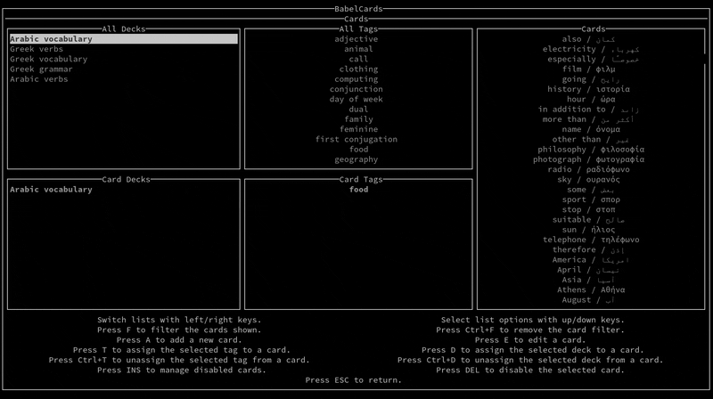
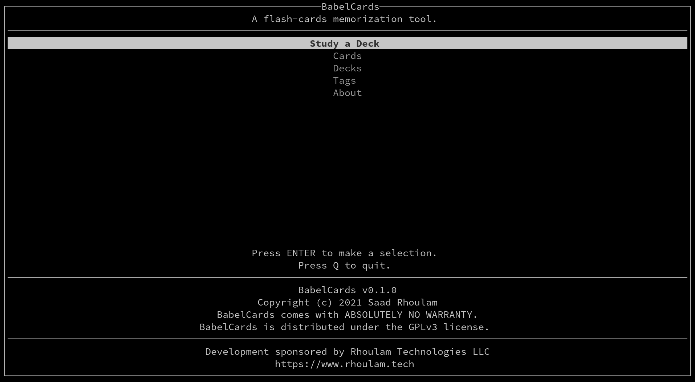
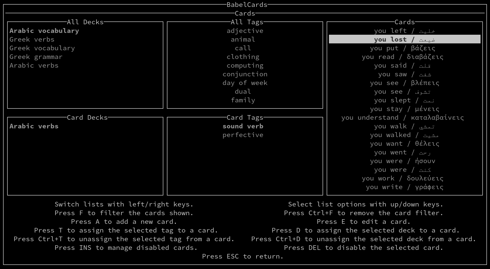
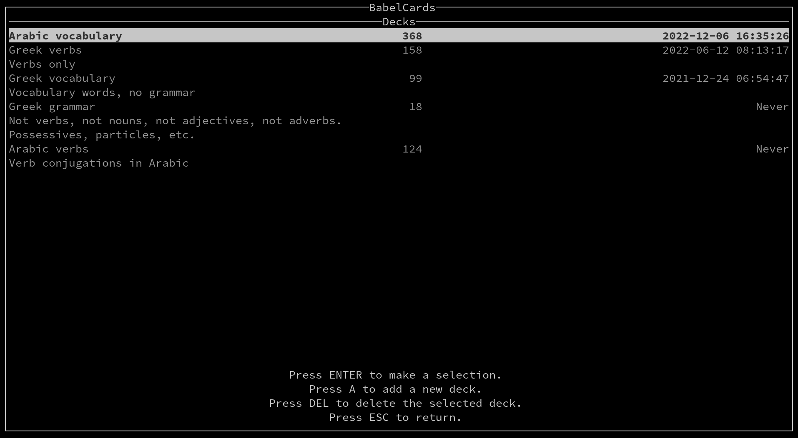
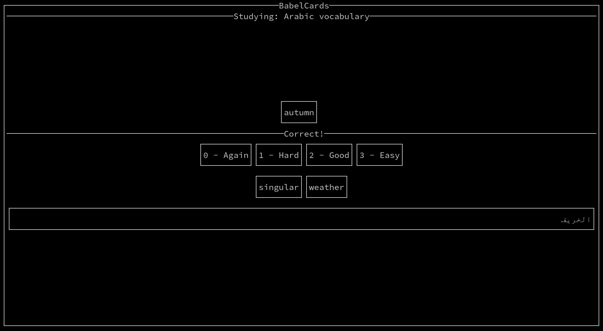
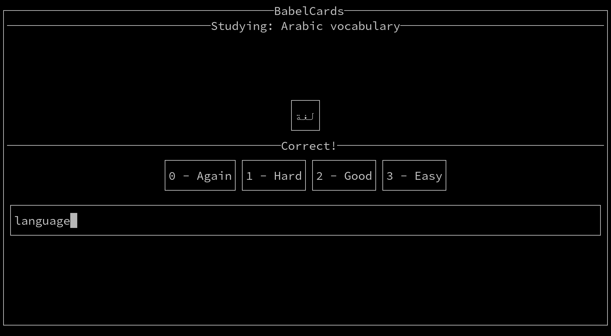

# Babel Cards

A TUI flash cards application.

For right-to-left languages, you will need to start babel-cards from within [bicon](https://github.com/behdad/bicon).

## [Development Blog](https://www.rhoulam.tech/blog/tags/babel-cards.html)

### Screenshots

## Building

`stack build`

## Usage

`stack exec -- babel-cards`

## Environment Variables

`BABEL_DATABASE` can be used to provide a path to a different SQLite3 database than the default.
